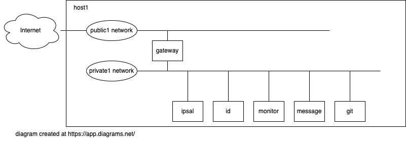

= Ansible playbook for setting up a network of VMs

Ansible helps me build my home lab. 
I'm halfway through turning a PC into a hypervisor that runs a pile-load (that's the technical term) of Virtual Machines. 
This needs work. 
I mean, who names a network *test0*?

If you can read Ansible's YAML, start with   
https://github.com/nickhardiman/ansible-playbook-lab/blob/main/main.yml[main.yml]. 

Each machine has one job to do.
For instance, *dhcp* is a VM that runs the core Internet service dhcp, *git* runs the developer service GitLab, and *metric* runs the time series database prometheus.

This playbook relies on a bunch (that's another technical term) of collections, including my https://github.com/nickhardiman/ansible-collection-platform[ansible-collection-platform].
Check out requirements.yml, described below.

== VMs 

 

The https://github.com/nickhardiman/ansible-playbook-lab/blob/main/group_vars/all/main.yml[defaults file] defines a lot of these values. 
For instance, 
MAC addresses are set to ** 52:54:00:03:00:* ** and 
IPv4 addresses are set to ** 192.168.134.* **. 
The domain *lab.example.com* is set per machine - check out dhcp's 
https://github.com/nickhardiman/ansible-playbook-lab/blob/main/host_vars/dhcp.lab.example.com/main.yml[host vars file].

Each of these hosts has a corresponding tasks file eg. 
machine-gateway.yml

.guests attached to bridges
[%header,format=csv]
|===
name,         interface, MAC,               IP,              domain
*public0*,    *brpublic0*,    52:54:00:01:00:01, 192.168.1.1,     home
gateway,      enp1s0,    52:54:00:00:00:03, 192.168.1.3,     home

*lab0*,  *brlab0*,   52:54:00:03:00:01, 192.168.134.1,   lab.example.com
 ,           ,           52:54:00:03:00:02, 192.168.134.2,   lab.example.com
gateway,      enp2s0,    52:54:00:03:00:03, 192.168.134.3,   lab.example.com
dhcp,         enp1s0,    52:54:00:03:00:04, 192.168.134.4,   lab.example.com
dns,          enp1s0,    52:54:00:03:00:05, 192.168.134.5,   lab.example.com
time,         enp1s0,    52:54:00:03:00:06, 192.168.134.6,   lab.example.com
git,          enp1s0,    52:54:00:03:00:07, 192.168.134.7,   lab.example.com
log,          enp1s0,    52:54:00:03:00:08, 192.168.134.8,   lab.example.com
metric,       enp1s0,    52:54:00:03:00:09, 192.168.134.9,   lab.example.com
id,           enp1s0,    52:54:00:03:00:10, 192.168.134.10,  lab.example.com
smtp,         enp1s0,    52:54:00:03:00:11, 192.168.134.11,  lab.example.com
repo-rhel8,   enp1s0,    52:54:00:03:00:12, 192.168.134.12,  lab.example.com
repo-rhel9,   enp1s0,    52:54:00:03:00:13, 192.168.134.13,  lab.example.com
mail,         enp1s0,    52:54:00:03:00:14, 192.168.134.14,  lab.example.com

|===

== cheat sheet

This playbook assumes you already have ansible set up.
The playbook uses _ansible_user_ to connect to all the machines, 
along with a key pair named _ansible-key.priv_ and _ansible-key.pub_. 

If you want to do the same kind of thing but 
haven't set it up yet, 
create ansible_user on your host machine. 

=== create ansible_user 

Use the root account.

Create a key pair for ansible_user. 
I called this ansible-key.priv and ansible-key.pub. 

[source,shell]
....
# create a new keypair 
ssh-keygen -f ./ansible-key -q -N ""
mv ansible-key  ansible-key.priv
....

Create the ansible_user account. 

[source,shell]
....
# create the user
useradd ansible_user
....

Copy the keys to ansible_user's SSH config directory. 

[source,shell]
....
# copy keys
mkdir /home/ansible_user/.ssh
chmod 0700 /home/ansible_user/.ssh
cp ansible-key.priv  /home/ansible_user/.ssh/id_rsa
chmod 0600 /home/ansible_user/.ssh/id_rsa
cp ansible-key.pub  /home/ansible_user/.ssh/id_rsa.pub
# SSH to localhost with key-based login
cat ansible-key.pub >> /home/ansible_user/.ssh/authorized_keys
chmod 0600 /home/ansible_user/.ssh/authorized_keys
chown -R ansible_user:ansible_user /home/ansible_user/.ssh
# allow passwordless sudo
echo 'ansible_user      ALL=(ALL)       NOPASSWD: ALL' > /etc/sudoers.d/ansible_user 
....

Allow passwordless sudo.

[source,shell]
....
echo 'ansible_user      ALL=(ALL)       NOPASSWD: ALL' > /etc/sudoers.d/ansible_user 
....

Copy the keys to your SSH config directory. 

[source,shell]
....
# copy keys
cp ansible-key.priv  /home/nick/.ssh/
cp ansible-key.pub  /home/nick/.ssh/
....

Add the location to ansible.cfg. 

[source,shell]
....
private_key_file = /home/nick/.ssh/ansible-key.priv
....

Check your work. 

[source,shell]
....
ssh -i /home/nick/.ssh/ansible-key.priv ansible_user@localhost
....

=== clone this repo 

This works with RHEL and Fedora. 
Some things, like that "dnf install" line, won't work on other OSs.

* Install packages.
* Get this code.

[source,shell]
....
# install packages
dnf install git ansible
# get code
REPOSITORY=ansible-playbook-lab
git clone https://github.com/nickhardiman/$REPOSITORY
cd $REPOSITORY
....

=== install collections and roles to ~/.ansible/

Some collections, like ansible.posix, are Red Hat Certified, from Ansible Automation Hub.
This requires an offline token. 

* Get a token from https://console.redhat.com/ansible/automation-hub/token#
* Set an environment variable.

[source,shell]
....
export ANSIBLE_GALAXY_SERVER_AUTOMATION_HUB_TOKEN=eyJhbGciOi...
ansible-galaxy collection install -r collections/requirements.yml 
....

* Install roles. 

[source,shell]
....
ansible-galaxy role install -r roles/requirements.yml 
....

=== Add Red Hat Subscription account to the vault

* Sign up for free at https://developers.redhat.com/.
* Check your account works by logging in at https://access.redhat.com/.
* Edit the vault file.
* Enter your Red Hat Subscription Manager account.
* Encrypt the file.

[source,shell]
....
vim vault-rhsm.yml
echo 'my vault password' >  ~/my-vault-pass
ansible-vault encrypt --vault-pass-file ~/my-vault-pass vault-rhsm.yml  
....

=== run, the AAP1 way

Build the network and machines.

[source,shell]
....
ansible-playbook main.yml
....

!!! possibly broken from here on down. 

Destroy everything. 
This has the power to remove any local libvirt virtual machine, so it's dangerous. 

[source,shell]
....
ansible-playbook  --ask-become-pass  delete.yml
....

or something similar like

[source,shell]
....
ansible-playbook \
  --inventory=./inventory-hypervisor.ini  \
  --become-password-file=~/my-pass \
  --extra-var='hosts=["kvm-guest"]' \
  delete.yml 
....

=== run, the AAP2 way

Create

required?
  --playbook-artifact-enable=false \

[source,shell]
....
ansible-navigator run main.yml \
  --become-password-file=~/my-pass \
  --mode=stdout \
  --eei hub1.lab.example.com/my_new_ee  \
  --extra-var='rhsm_user=RH_user'  \
  --extra-var='rhsm_password=RH_password' \
  --extra-var='rhsm_pool_id=12345'  
....

